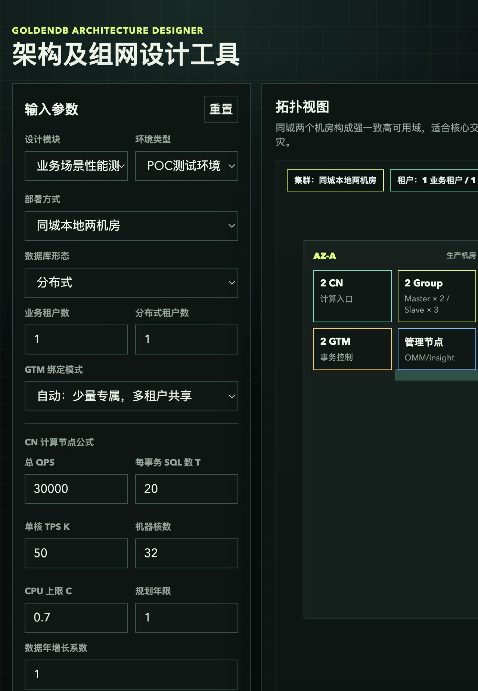
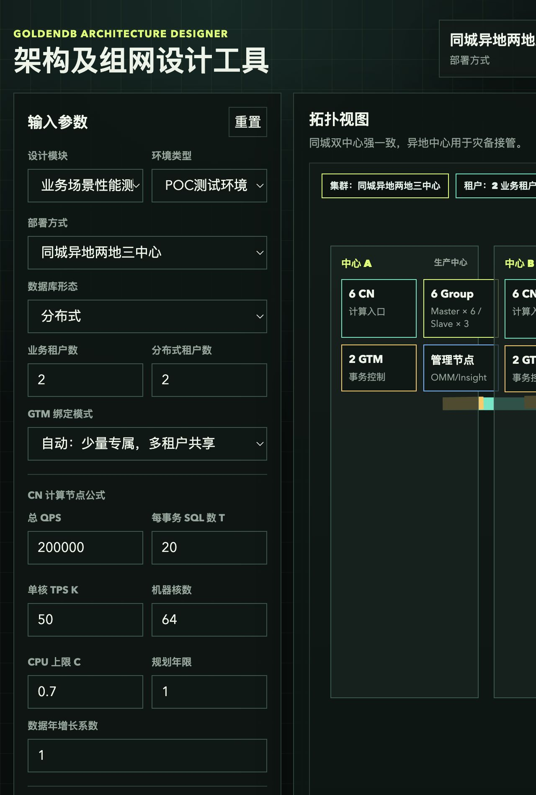
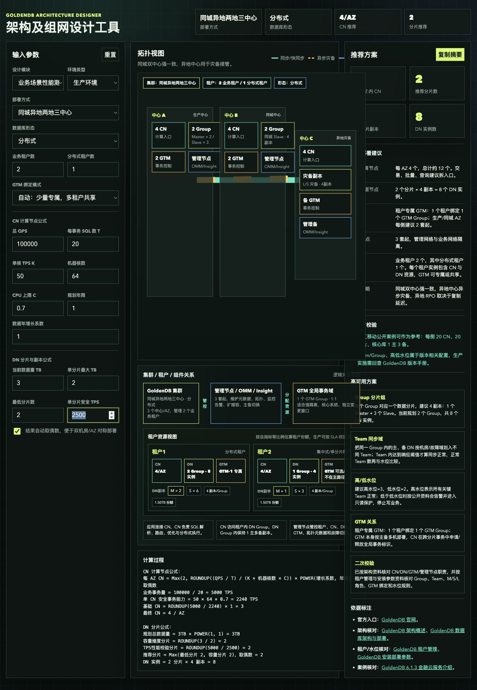
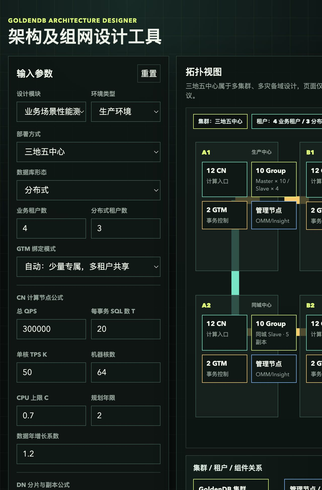
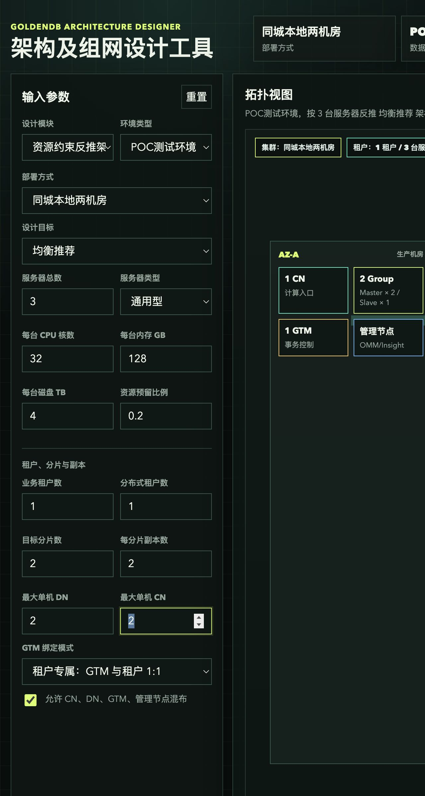
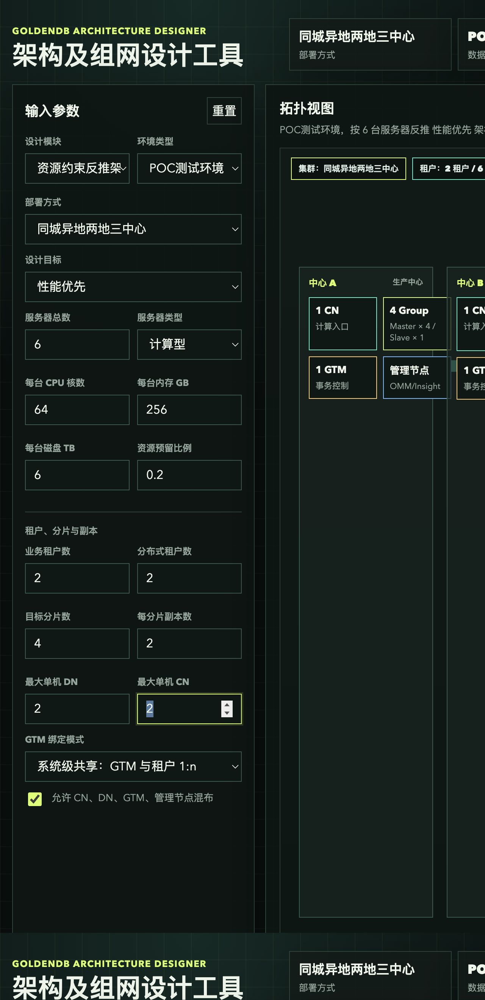
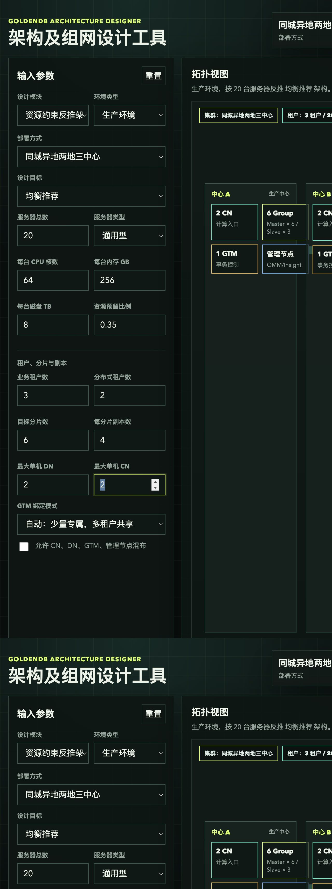
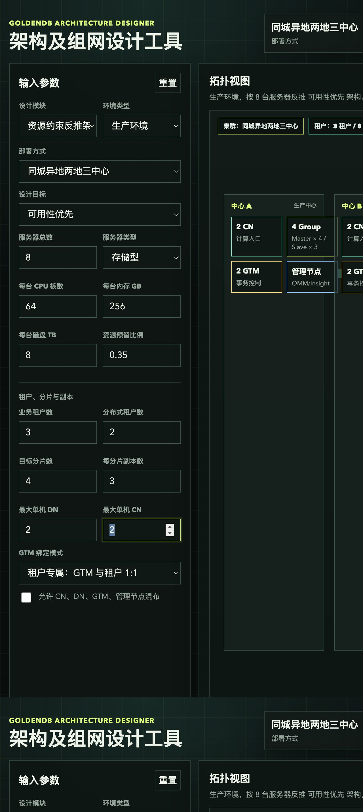

# GoldenDB 架构及组件设计工具测试用例报告

日期：2026-08-04  
测试对象：`goldendb-architecture-designer/index.html`  
测试范围：设计模块切换、环境类型切换、业务场景性能测算、资源约束反推架构、POC/生产规则、拓扑与结果联动。

## 一、测试结论

本轮共执行 8 个用例，覆盖：

- 业务场景性能测算 / POC 测试环境：2 个
- 业务场景性能测算 / 生产环境：2 个
- 资源约束反推架构 / POC 测试环境：2 个
- 资源约束反推架构 / 生产环境：2 个

最终结果：8/8 通过。

评估结论：

1. `业务场景性能测算` 与 `资源约束反推架构` 参数已隔离，切换模块后不会互相污染。
2. 业务测算模块仍按原 CN/DN 公式输出，结果和预期一致。
3. 资源反推模块能按服务器数量、租户、分片、副本、GTM、混布规则输出资源状态、服务器部署视图和风险提示。
4. POC 环境默认允许混布，适合测试验证；生产环境默认关闭混布，并按生产规则修正副本数和提示资源风险。
5. 生产高可用不足场景能正确识别服务器不足，并提示副本修正、DN 密度和扩容风险。

## 二、用例总览

| 编号 | 设计模块 | 环境类型 | 场景 | 关键结果 | 评估 |
| --- | --- | --- | --- | --- | --- |
| TC-01 | 业务场景性能测算 | POC测试环境 | 小规模同城两机房 | 2 CN/AZ，2 分片，4 副本，8 DN | 通过 |
| TC-02 | 业务场景性能测算 | POC测试环境 | 高 QPS 压测 | 6 CN/AZ，6 分片，4 副本，24 DN | 通过 |
| TC-03 | 业务场景性能测算 | 生产环境 | 两地三中心默认核心库 | 4 CN/AZ，2 分片，4 副本，8 DN | 通过 |
| TC-04 | 业务场景性能测算 | 生产环境 | 三地五中心扩展 | 12 CN/AZ，10 分片，5 副本，50 DN | 通过 |
| TC-05 | 资源约束反推架构 | POC测试环境 | 3 台最小验证 | 资源充足，2 CN，4 DN，1 GTM，3 管理节点 | 通过 |
| TC-06 | 资源约束反推架构 | POC测试环境 | 6 台性能优先 | 资源充足，3 CN，8 DN，1 GTM，3 管理节点 | 通过 |
| TC-07 | 资源约束反推架构 | 生产环境 | 20 台均衡推荐 | 资源临界，6 CN，24 DN，2 GTM，3 管理节点 | 通过 |
| TC-08 | 资源约束反推架构 | 生产环境 | 8 台高可用不足校验 | 资源不足，副本数 3 自动修正为 4 | 通过 |

## 三、详细用例

### TC-01：业务测算 / POC / 小规模同城两机房

参数：

| 参数 | 值 |
| --- | --- |
| 设计模块 | 业务场景性能测算 |
| 环境类型 | POC测试环境 |
| 部署方式 | 同城本地两机房 |
| 数据库形态 | 分布式 |
| 业务租户数 / 分布式租户数 | 1 / 1 |
| QPS / 每事务 SQL 数 | 30000 / 20 |
| 单核 TPS / CPU 核数 / CPU 上限 | 50 / 32 / 0.7 |
| 数据量 / 单分片最大 | 1TB / 2TB |
| 最低分片数 | 2 |

结果：

| 指标 | 页面输出 |
| --- | --- |
| 每 AZ CN | 2 |
| 推荐分片数 | 2 |
| 每分片副本 | 4 |
| DN 实例数 | 8 |

评估：通过。小规模 POC 被最低 CN 与最低分片约束兜底，输出符合预期。

### TC-02：业务测算 / POC / 高 QPS 压测

参数：

| 参数 | 值 |
| --- | --- |
| 设计模块 | 业务场景性能测算 |
| 环境类型 | POC测试环境 |
| 部署方式 | 同城异地两地三中心 |
| 数据库形态 | 分布式 |
| 业务租户数 / 分布式租户数 | 2 / 2 |
| QPS / 每事务 SQL 数 | 200000 / 20 |
| 单核 TPS / CPU 核数 / CPU 上限 | 50 / 64 / 0.7 |
| 数据量 / 单分片最大 | 9TB / 2TB |
| 最低分片数 | 2 |

结果：

| 指标 | 页面输出 |
| --- | --- |
| 每 AZ CN | 6 |
| 推荐分片数 | 6 |
| 每分片副本 | 4 |
| DN 实例数 | 24 |

评估：通过。QPS 推高 CN 数，数据量推高分片数，最终取偶数后为 6 CN/AZ、6 分片。

### TC-03：业务测算 / 生产 / 两地三中心默认核心库

参数：

| 参数 | 值 |
| --- | --- |
| 设计模块 | 业务场景性能测算 |
| 环境类型 | 生产环境 |
| 部署方式 | 同城异地两地三中心 |
| 数据库形态 | 分布式 |
| 业务租户数 / 分布式租户数 | 2 / 1 |
| QPS / 每事务 SQL 数 | 100000 / 20 |
| 单核 TPS / CPU 核数 / CPU 上限 | 50 / 64 / 0.7 |
| 数据量 / 单分片最大 | 3TB / 2TB |
| 最低分片数 | 2 |

结果：

| 指标 | 页面输出 |
| --- | --- |
| 每 AZ CN | 4 |
| 推荐分片数 | 2 |
| 每分片副本 | 4 |
| DN 实例数 | 8 |

评估：通过。默认生产参数保持原公式结果，未被资源反推模块影响。

### TC-04：业务测算 / 生产 / 三地五中心扩展

参数：

| 参数 | 值 |
| --- | --- |
| 设计模块 | 业务场景性能测算 |
| 环境类型 | 生产环境 |
| 部署方式 | 三地五中心 |
| 数据库形态 | 分布式 |
| 业务租户数 / 分布式租户数 | 4 / 3 |
| QPS / 每事务 SQL 数 | 300000 / 20 |
| 规划年限 / 增长系数 | 2 / 1.2 |
| 数据量 / 单分片最大 | 12TB / 2TB |
| 最低分片数 | 4 |

结果：

| 指标 | 页面输出 |
| --- | --- |
| 每 AZ CN | 12 |
| 推荐分片数 | 10 |
| 每分片副本 | 5 |
| DN 实例数 | 50 |

评估：通过。三地五中心自动采用 5 副本；12TB 按 1.2 的 2 年增长后为 17.28TB，容量维度分片为 9，取偶数后为 10。

### TC-05：资源反推 / POC / 3 台最小验证

参数：

| 参数 | 值 |
| --- | --- |
| 设计模块 | 资源约束反推架构 |
| 环境类型 | POC测试环境 |
| 部署方式 | 同城本地两机房 |
| 设计目标 | 均衡推荐 |
| 服务器总数 | 3 |
| 服务器规格 | 32C / 128GB / 4TB |
| 租户数 / 分布式租户数 | 1 / 1 |
| 分片数 / 副本数 | 2 / 2 |
| GTM 绑定 | 租户专属 |
| 是否允许混布 | 是 |

结果：

| 指标 | 页面输出 |
| --- | --- |
| 资源状态 | 充足 |
| CN / DN / GTM / 管理节点 | 2 / 4 / 1 / 3 |
| 分片与副本 | 2 Group × 2 副本 |
| 综合评分 | 84/100 |

评估：通过。POC 最小验证允许混布，页面明确提示可用于 POC 验证，生产需重新按隔离规则评审。

### TC-06：资源反推 / POC / 6 台性能优先

参数：

| 参数 | 值 |
| --- | --- |
| 设计模块 | 资源约束反推架构 |
| 环境类型 | POC测试环境 |
| 部署方式 | 同城异地两地三中心 |
| 设计目标 | 性能优先 |
| 服务器总数 | 6 |
| 服务器规格 | 64C / 256GB / 6TB |
| 租户数 / 分布式租户数 | 2 / 2 |
| 分片数 / 副本数 | 4 / 2 |
| GTM 绑定 | 系统级共享 |
| 是否允许混布 | 是 |

结果：

| 指标 | 页面输出 |
| --- | --- |
| 资源状态 | 充足 |
| CN / DN / GTM / 管理节点 | 3 / 8 / 1 / 3 |
| 分片与副本 | 4 Group × 2 副本 |
| 综合评分 | 85/100 |

评估：通过。性能优先 POC 可在 6 台服务器上完成压测型部署，DN 实例数与分片副本公式一致。

### TC-07：资源反推 / 生产 / 20 台均衡推荐

参数：

| 参数 | 值 |
| --- | --- |
| 设计模块 | 资源约束反推架构 |
| 环境类型 | 生产环境 |
| 部署方式 | 同城异地两地三中心 |
| 设计目标 | 均衡推荐 |
| 服务器总数 | 20 |
| 服务器规格 | 64C / 256GB / 8TB |
| 资源预留比例 | 35% |
| 租户数 / 分布式租户数 | 3 / 2 |
| 分片数 / 副本数 | 6 / 4 |
| 是否允许混布 | 否 |

结果：

| 指标 | 页面输出 |
| --- | --- |
| 资源状态 | 临界 |
| CN / DN / GTM / 管理节点 | 6 / 24 / 2 / 3 |
| 分片与副本 | 6 Group × 4 副本 |
| 综合评分 | 82/100 |

评估：通过。生产环境按分层部署和 35% 资源预留后处于临界状态，页面给出“可做生产初评，建议扩容后上线”的判断，符合生产规则。

### TC-08：资源反推 / 生产 / 8 台高可用不足校验

参数：

| 参数 | 值 |
| --- | --- |
| 设计模块 | 资源约束反推架构 |
| 环境类型 | 生产环境 |
| 部署方式 | 同城异地两地三中心 |
| 设计目标 | 可用性优先 |
| 服务器总数 | 8 |
| 服务器规格 | 64C / 256GB / 8TB |
| 资源预留比例 | 35% |
| 租户数 / 分布式租户数 | 3 / 2 |
| 分片数 / 输入副本数 | 4 / 3 |
| GTM 绑定 | 租户专属 |
| 是否允许混布 | 否 |

结果：

| 指标 | 页面输出 |
| --- | --- |
| 资源状态 | 不足 |
| CN / DN / GTM / 管理节点 | 6 / 16 / 4 / 3 |
| 分片与副本 | 4 Group × 4 副本 |
| 综合评分 | 74/100 |

评估：通过。生产环境输入 3 副本被规则自动提升为 4 副本；8 台服务器无法满足高可用分层部署，页面正确提示服务器不足、DN 密度风险和扩容建议。

## 四、最终评估

本轮测试确认：

- 设计模块切换正确：业务测算模块隐藏资源反推参数，资源反推模块隐藏业务公式参数。
- 环境类型规则正确：POC 支持混布验证，生产默认不混布并执行副本修正规则。
- 业务测算结果正确：CN、分片、副本、DN 实例数符合页面公式。
- 资源反推结果正确：能根据服务器数、分片、副本、租户、GTM 和混布策略反推资源状态与服务器部署视图。
- 风险提示正确：生产资源不足、生产副本修正、临界资源状态、POC 不可直接用于生产等提示均能触发。

结论：当前功能可以进入下一轮人工评审。若用于正式 POC 或生产方案输出，还建议补充真实机型性能基线、网络带宽、磁盘 IOPS、GoldenDB 版本参数和厂商实施建议。
